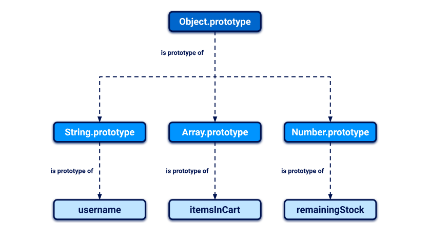
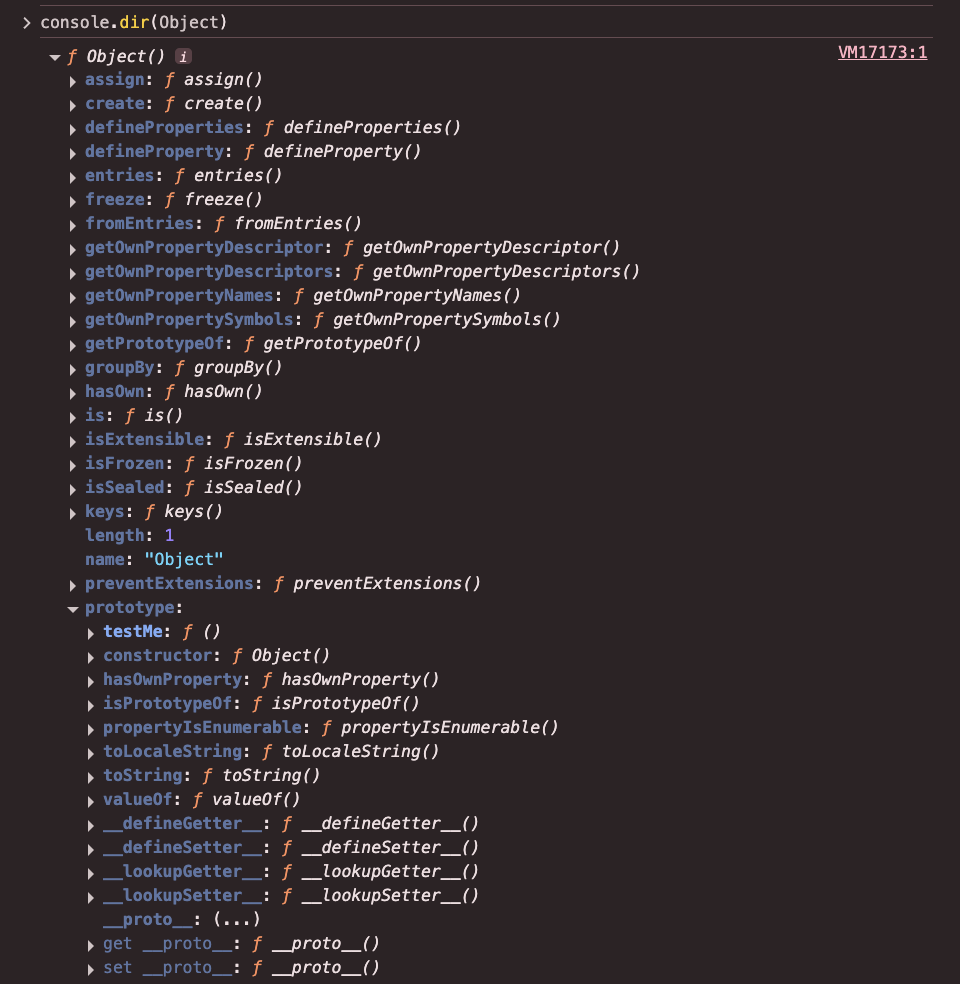
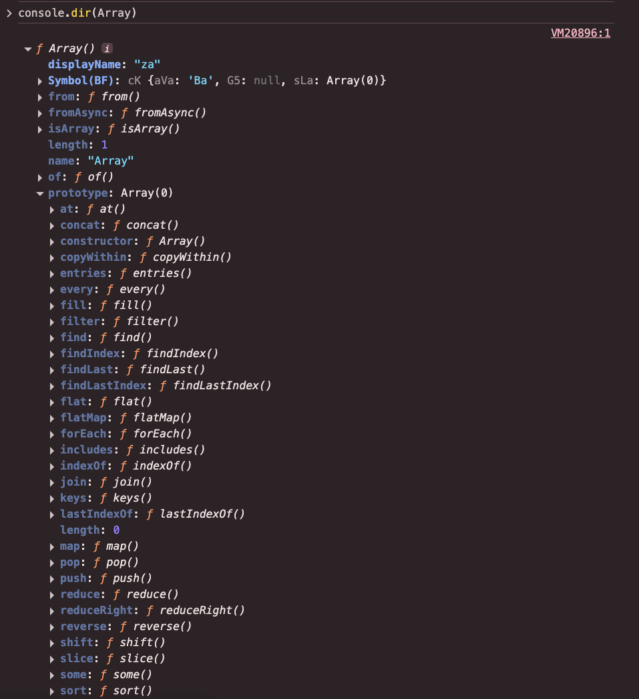

# JS 요리교실 6주차: 프로토타입

## 1. `Object.prototype`에 관한 주의사항

자바스크립트의 모든 생성자 함수는 `prototype`이라는 속성을 가집니다. 이 `prototype`은 객체이며, 해당 생성자 함수로 생성된 인스턴스들이 공유하는 프로토타입 객체입니다.

대표적인 예시는 다음과 같습니다.

- `Array.prototype`
- `Function.prototype`
- `String.prototype`
- `Object.prototype`
- ...

모든 `prototype` 객체는 결국 **최상단에 위치한 `Object.prototype`을 상속받습니다**.
즉, 어떤 생성자 함수든 그 `prototype`은 프로토타입 체인을 따라 `Object.prototype`과 연결됩니다.



따라서 **`Object.prototype`에 메서드를 정의하면, 거의 모든 데이터 타입에서 해당 메서드를 사용할 수 있게 됩니다.**

이는 다음과 같은 구조적 특성 때문입니다:

- `Object.prototype`은 모든 객체의 조상격 프로토타입
- 모든 인스턴스는 해당 타입의 `prototype`을 거쳐 결국 `Object.prototype`까지 체인 연결됨

## 2. 정적 메서드 (Static Method)

자바스크립트에서 `Object` 생성자 함수는 객체 전용 유틸리티 메서드들을 **정적 메서드**로 제공합니다.



반면, `Array`, `String`, `Function` 등은 인스턴스가 직접 호출할 수 있는 **프로토타입 메서드**를 함께 제공합니다.



### 정리: 정적 메서드와 프로토타입 메서드의 차이점

| 구분              | 정의 위치               | 호출 방식            | 예시                      |
| ----------------- | ----------------------- | -------------------- | ------------------------- |
| 정적 메서드       | 생성자 함수 자체        | `Object.method(obj)` | `Object.hasOwn(obj, 'a')` |
| 프로토타입 메서드 | `Constructor.prototype` | `obj.method()`       | `[1,2,3].push(4)`         |

> ✅ 인스턴스는 **프로토타입 메서드만 상속**합니다.
> ❌ 따라서 정적 메서드는 인스턴스로 접근할 수 없습니다.

```js
const obj = { a: 1 };

console.log(Object.hasOwn(obj, "a")); // ✅ true
console.log(obj.hasOwn("a")); // ❌ TypeError: obj.hasOwn is not a function
```

### 왜 정적 메서드로 구현되었나?

이는 `Object.prototype` 오염 방지를 위한 설계입니다. `Object.prototype`에 메서드를 추가하는 것은 전체 런타임 환경에 영향을 미칩니다.

## 3. 전역 오염의 위험

`Object.prototype`은 모든 객체가 상속받는 최상위 프로토타입입니다.

이 말은 곧, 여기에 어떤 속성이나 메서드를 추가하면 **모든 객체에 영향**을 주게 됩니다.

```js
const obj = {};
obj.__proto__.greet = function () {
  console.log("안녕하세요!");
};

const another = {};
another.greet(); // 안녕하세요! (❗ 예기치 않은 결과)

[].greet(); // 배열도 인사함
({}).greet(); // 객체도 인사함
(function () {}).greet(); // 함수도 인사함
```

이런 식으로 전역 오염이 발생하면:

- 예측 불가능한 동작이 나타날 수 있고,
- 라이브러리나 프레임워크의 내부 동작이 망가지며,
- 유지보수가 매우 어려워집니다.
