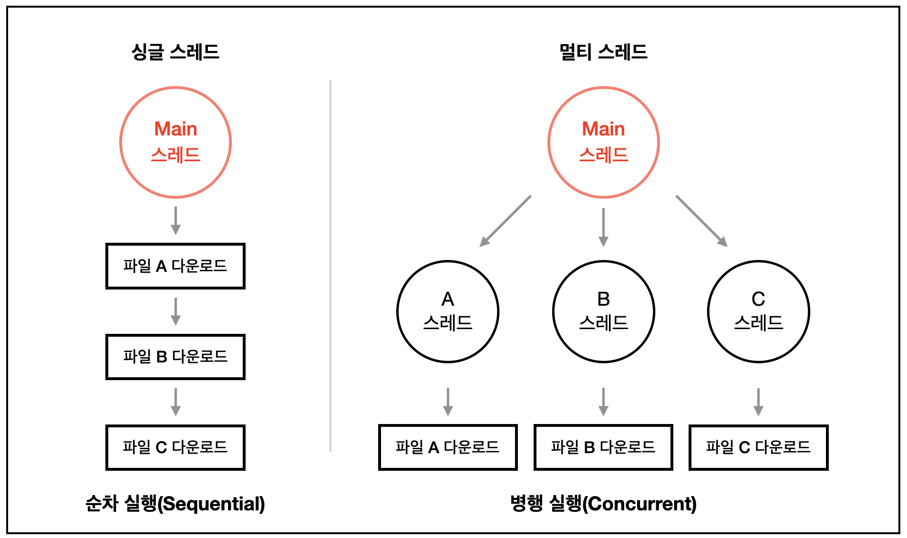
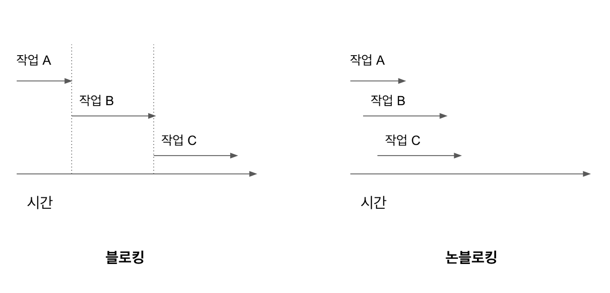
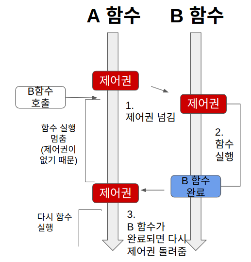
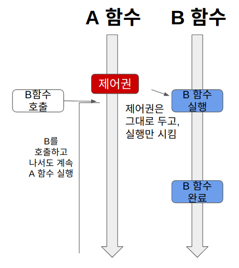
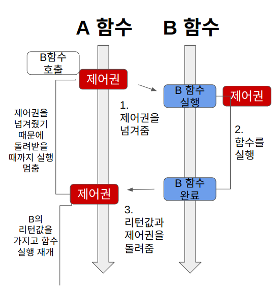
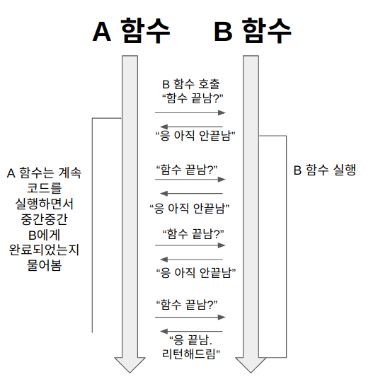
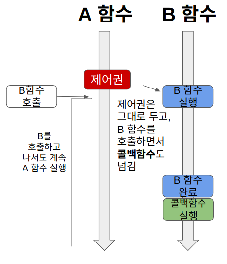
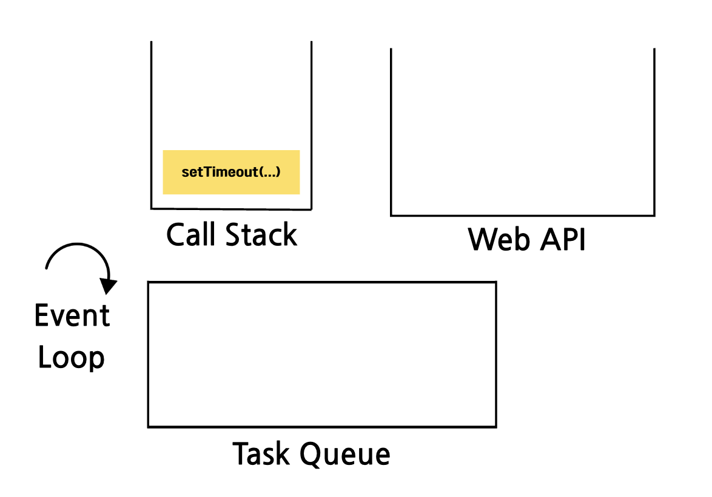
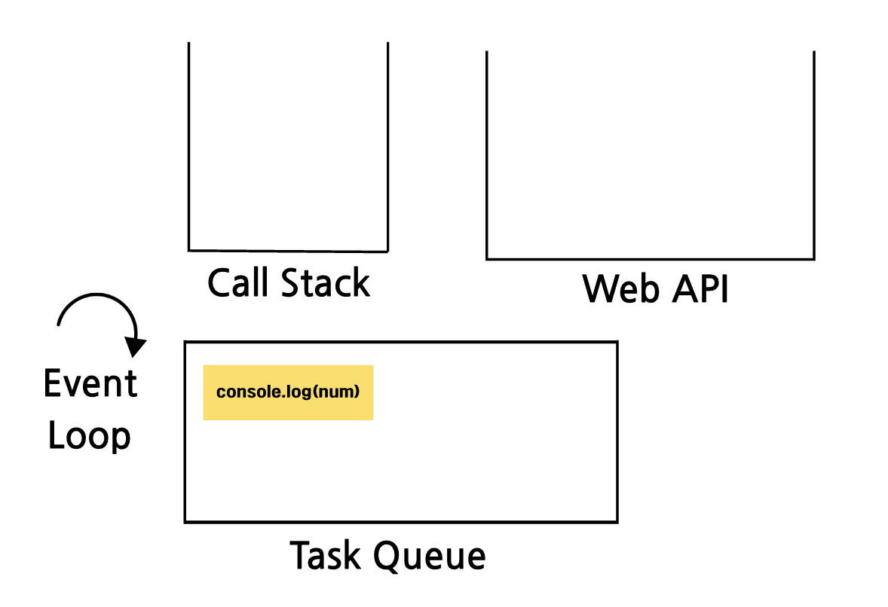

# 자바스크립트의 동작 원리

## 1. 자바스크립트

자바스크립트는 **싱글 스레드** 언어이자 **논블로킹**(비동기 실행 모델) 언어이다.

**싱글 스레드**란 쉽게 말해서 한 번에 하나의 작업(프로세스)만 처리할 수 있는 실행 모델을 의미한다.


**논블로킹**은 한 작업이 진행 중에도 다른 작업을 수행할 수 있는 상태를 의미한다. 즉, 한 작업이 실행되기 위해 다른 작업을 멈추지 않고 동시에 처리될 수 있는 것이다.


여기서 의문을 가질 수 있다.

> 🤔 싱글 스레드라면서, 논블로킹이라는 건 뭐지?

## 2. 사전 지식

Block과 non-block, sync와 async 개념을 이해하기 위해서는 다음의 두 용어를 짚고 넘어가야 한다.

### 1) 제어권

제어권은 함수가 자신의 코드를 실행할 권리 같은 것이다. 제어권을 가진 함수는 자신의 코드를 끝까지 실행한 후, 자신을 호출한 함수에게 돌려준다.

```js
// setTimeout은 콜백 함수의 제어권을 가진다.
// 1초가 지나면 콜백함수를 자신(setTimeout)이 실행한다.

setTimeout(()=>{...}, 1000);
```

### 2) 결과값을 기다린다는 것

A 함수에서 B 함수를 호출했을 때, A 함수가 B 함수의 결과값을 기다리느냐의 여부를 의미한다.

```js
// console.log 메서드는 result의 결과 값을 기다린다.
const result = await fetch("...");
console.log(result);
```

## 3. Blocking(블로킹)과 Non-blocking(논블로킹)

블로킹과 논블로킹은 A 함수가 B 함수를 호출했을 때, 제어권을 어떻게 처리하느냐에 따라 달라진다.

### 1) 블로킹

블로킹은 A 함수가 B 함수를 호출하면, 제어권을 A가 호출한 B 함수에 넘겨준다.



1. A함수가 B함수를 호출하면 B에게 제어권을 넘긴다.
2. 제어권을 넘겨받은 B는 열심히 함수를 실행한다. A는 B에게 제어권을 넘겨주었기 때문에 함수 실행을 잠시 멈춘다.
3. B함수는 실행이 끝나면 자신을 호출한 A에게 제어권을 돌려준다.

#### 블로킹 예시

`setTimeout`처럼 비동기 함수가 아닌 동기 함수를 실행할 때 블로킹이 발생할 수 있다.

```js
function taskA() {
  console.log("A 시작");
  taskB(); // taskB를 호출
  console.log("A 끝");
}

function taskB() {
  console.log("B 시작");
  // 3초 대기 (시간이 오래 걸리는 작업)
  const start = Date.now();
  while (Date.now() - start < 3000) {} // 3초간 아무 것도 하지 않음
  console.log("B 끝");
}

taskA();
```

#### 출력

```zsh
A 시작
B 시작
B 끝
A 끝
```

### 2) 논블로킹

논블로킹은 A함수가 B함수를 호출해도 제어권은 그대로 자신이 가지고 있는다.



1. A함수가 B함수를 호출하면, B 함수는 실행되지만, 제어권은 A 함수가 그대로 가지고 있는다.
2. A함수는 계속 제어권을 가지고 있기 때문에 B함수를 호출한 이후에도 자신의 코드를 계속 실행한다.

#### 논블로킹 예시

동기 함수를 `setTimeout` 같은 비동기 함수의 콜백으로 넣어주면 논블로킹으로 진행된다.

```js
function taskA() {
  console.log("A 시작");
  setTimeout(taskB, 0); // taskB를 비동기로 호출
  console.log("A 끝");
}

function taskB() {
  console.log("B 시작");
  // 3초 대기 (시간이 오래 걸리는 작업)
  const start = Date.now();
  while (Date.now() - start < 3000) {} // 3초간 아무 것도 하지 않음
  console.log("B 끝");
}

taskA();
```

#### 출력

```zsh
A 시작
A 끝
B 시작
B 끝
```

## 4. Synchronous(동기)와 Asynchronous(비동기)

동기와 비동기의 차이는 **호출되는 함수의 작업 완료 여부를 신경쓰는지**의 여부의 차이이다.

### 1) 동기

함수 A가 함수 B를 호출한 후, 함수 B의 작업이 끝날 때까지 기다리는 방식

함수 B가 끝날 때까지 함수 A는 멈추고, 함수 B가 끝난 후에야 다음 작업을 수행한다.

### 2) 비동기

함수 A가 함수 B를 호출하고, 함수 B의 작업이 완료될 때까지 기다리지 않고, 함수 A의 실행을 이어간다.

이후 함수 B의 작업이 끝나면 **콜백 함수**가 실행되어 결과를 처리한다.

함수 A는 함수 B를 호출한 후로 함수 B의 작업 완료 여부에는 신경쓰지 않는다.

## 5. 블로킹과 논블로킹, 동기와 비동기 비교

### 1) Sync-Blocking

- 함수 A는 함수 B의 리턴값을 필요로 한다 (**동기**).

- 제어권을 함수 B에게 넘겨주고, 함수 B가 실행을 완료하여 리턴값과 제어권을 돌려줄때까지 기다린다 (**블로킹**).



### 2) Sync-Nonblocking

동기를 논블로킹처럼 작동시킬 수 있다. 다음의 그림을 보자.



- A 함수는 B 함수를 호출한다. 이 때 A 함수는 B 함수에게 제어권을 주지 않고, 자신의 코드를 계속 실행한다(**논블로킹**).

- A 함수는 B 함수의 리턴값이 필요하기 때문에, 중간중간 B 함수에게 함수 실행을 완료했는지 물어본다(**동기**).

- 즉, 논블로킹인 동시에 동기인 것.

### 3) Async-Nonblocking

- A 함수가 B 함수를 호출하면 제어권을 B 함수에 주지 않고, 자신이 계속 가지고 있는다(**논블로킹**).

=> B 함수를 호출한 이후에도 멈추지 않고 자신의 코드를 계속 실행한다.

- B 함수를 호출할 때 콜백함수를 함께 준다. B 함수는 자신의 작업이 끝나면 A 함수가 준 콜백 함수를 실행한다(**비동기**).



### 4) Async-blocking

Async-blocking의 경우는 사실 잘 마주하기 쉽지 않다.

- A 함수는 B 함수의 리턴값에 신경쓰지 않고, 콜백함수를 보낸다(**비동기**).

- 그런데, B 함수의 작업에 관심없음에도 불구하고, A 함수는 B 함수에게 제어권을 넘긴다(**블로킹**).

- 따라서, A 함수는 자신과 관련 없는 B 함수의 작업이 끝날 때까지 기다려야 한다.


Async-blocking의 경우 sync-blocking과 성능의 차이가 비슷하기 때문에 사용하는 경우는 거의 없다.

## 6. 자바스크립트 내부 구조

자바스크립트 엔진은 크게 다음과 같은 주요 구성 요소를 가지고 있다.

### 1) 콜 스택 (Call Stack)

- 자바스크립트의 실행 컨텍스트가 쌓이는 메모리 공간
- 함수가 실행될 때마다 생성되는 실행 컨텍스트가 쌓이고, 함수가 종료되면 제거됨
- 이를 통해 코드 순서를 관리

### 2) 메모리 힙 (Memory Heap)

- 동적 메모리 할당이 이루어지는 영역
- 변수, 객체, 배열 등과 같은 데이터가 저장
- 메모리 힙에 저장된 데이터들을 가리키는 참조가 실행 컨텍스트 내에서 관리함
- 메모리 힙은 **가비지 컬렉션**에 의해 관리되며, 사용되지 않는 메모리를 자동으로 회수됨

### 3) Web API (브라우저)

- 자바스크립트가 비동기적인 작업을 수행할 수 있도록 돕는 기능을 제공하는 브라우저의 내장 API
- `setTimeout`, `fetch`, `XMLHttpRequest`, `localStorage` 등과 같은 비동기 작업을 처리
- 자바스크립트 엔진 외부(브라우저/Node.js)에서 비동기 작업 처리를 담당

### 4) 태스크 큐 (Task Queue)

- 비동기 작업의 콜백 함수가 대기하는 메모리 공간
- Web API에서 처리한 비동기 함수들의 콜백은 태스크 큐에 저장됨
- 이벤트 루프에 의해 **콜 스택이 비어있을 때** 콜 스택에 쌓인 후, 실행 됨

### 5) 이벤트 루프 (Event Loop)

- 태스크 큐에 쌓인 콜백 함수를 콜 스택으로 이동시키는 역할 수행
- 콜 스택이 비어 있을 때 태스크 큐에 대기 중인 함수들을 콜 스택으로 가져와 실행
- 이를 통해 비동기 코드가 동기 코드처럼 순차적으로 실행되는 것처럼 보이도록 함

## 7. 자바스크립트 동작 원리

다음과 같이 동기 코드와 비동기 코드가 동시에 존재한다고 해보자. `setTimeout`의 시간은 "0초"로 설정했다.

```js
let num = 1;

console.log(num);

setTimeout(() => {
  num = 2;
  console.log(num);
}, 0);

num = 3;
console.log(num);
```

실행 결과는 어떻게 될까?

#### 출력 결과

```zsh
1
3
2
```

1 -> 2 -> 3으로 출력될 줄 알았던 예상과 달리 1과 3이 먼저 출력되고, 그 다음에 2가 출력되었다.

왜 이런 결과가 나왔는지 자바스크립트 내부 구조를 보면서 동작 원리를 이해해보자.

### 1) 콜 스택

자바스크립트에서 함수가 실행되면 "실행 컨텍스트"라는 것이 생성된다.

이때, **콜 스택에 쌓이는 것이 바로 함수의 실행 컨텍스트**이다.

실행 컨텍스트의 종류는 함수 외에도 전역, eval, 모듈 등 다양하지만 주제를 벗어나므로 함수만 다뤄보겠다.

위 예제 코드에서 첫 번째 `console.log` 함수가 실행되면 다음과 같은 구조가 될 것이다.


위 상태에서 `num`의 값은 1이고, 현재 콜 스택에 이 함수의 실행 컨텍스트밖에 존재하지 않으므로 바로 실행 시키고 콜 스택에서 제거 시킨다.
(자바스크립트 엔진은 콜 스택의 제일 위에 있는 실행 컨텍스트를 실행시킨다.)

그 다음, 콜 스택이 비어 있는 상태에서 `setTimeout` 비동기 함수가 들어왔다.



자바스크립트 엔진은 어떤 실행 컨텍스트가 비동기 함수의 실행 컨텍스트인지 알고 있다. 즉, 어떤 함수가 비동기 함수인지 알고 있다.

비동기 함수가 콜 스택에 쌓이면, 자바스크립트 엔진은 **콜스택에서 우선 제거**한다.

그 다음, **Web API에 비동기 작업을 위탁**하고, 그 다음 동기 코드를 수행할 준비를 한다. 그럼 다음과 같은 형태가 된다.


이때 콜 스택에 들어온 `console.log` 실행 컨텍스트를 실행해주어야 하는데, 이 시점에서 `num`은 3이다. 왜냐하면 `setTimeout`을 아직 콜 스택에서 실행시키지 않았기 때문이다.

따라서 콜 스택에 들어온 `console.log`를 실행하면 3이 출력되고, 실행 컨텍스트가 제거된다.

`setTimeout`에 할당된 타이머가 Web API에서 모두 끝나고 나면(비동기 작업이 끝나면) **비동기 함수에 할당된 콜백은 Task Queue로 들어간다.**



태스크 큐에 존재하는 콜백 함수들은 이벤트 루프에 의해서 콜 스택으로 접근할 수가 있다.

태스크 큐에서 콜 스택으로 들어가기 위한 조건은 "**현재 콜 스택이 비어있는가**"이다. 만약 콜 스택에 실행 컨텍스트가 하나라도 존재하는 상태라면 비동기 함수의 콜백 함수가 태스크 큐에 계속 남아 있게 된다.

이벤트 루프는 계속 콜 스택의 상태를 검사하면서, 태스크 큐에 있는 콜백을 콜 스택에 보낼 준비를 하고, 마침 지금 콜 스택이 비어있으니 올려보낸다.


이 시점에서 `num`은 2이므로, 2를 출력시키고 이 콜백 함수의 실행 컨텍스트가 콜 스택에서 제거된다.
