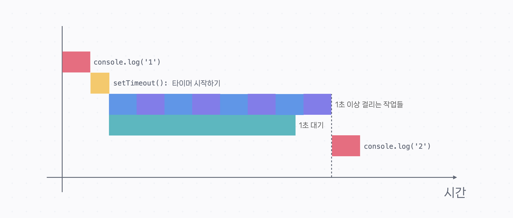
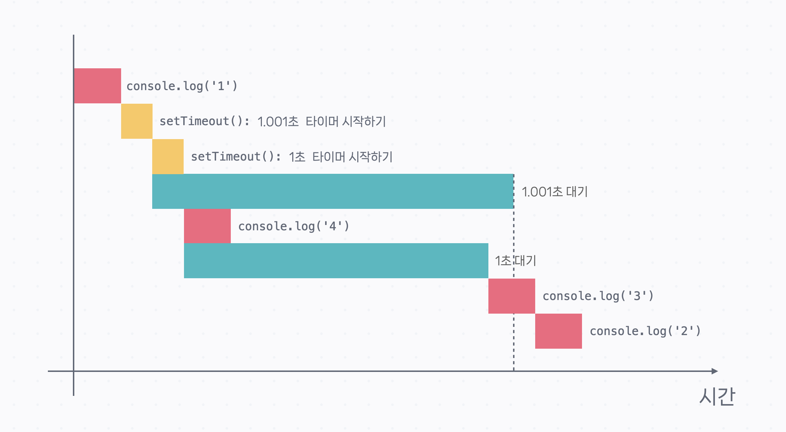

# 자바스크립트 비동기 프로그래밍

- 웹 리퀘스트 같이 실행에 비교적 오래 걸리는 코드가 있음
- 오래 걸리는 작업이 있으면 그 다음 작업을 먼저 처리하고, 다시 돌아와서 작업을 처리하는 것이 비동기 프로그래밍의 핵심 개념

## 1. Callback

- 어떤 함수의 arguments로 전달되는 함수
- 함수 선언문의 함수 식별자를 전달할 수 있지만, 간단한 콜백에는 화살표 함수도 자주 쓰임
- 비동기 프로그래밍에서 콜백은 중요한 개념

```js
function sayHello(name) {
  console.log(`Hello, ${name}!`);
}

function print(func, name) {
  func(name);
}

// 아래 두 코드는 같은 결과이다
print(sayHello, "Alice");
print((name) => console.log(`Hello, ${name}!`), "Alice");
```

## 2. 비동기 실행의 특징

### 1) 비동기 함수는 이후에 있는 코드들을 모두 실행하고 콜백 실행

- `setTimeout` 함수에 delay 값을 0을 전달해도, 제일 마지막에 실행됨
- 비동기 함수의 콜백은 아무리 먼저 실행돼도 **비동기 함수 이후에 있는 코드가 모두 실행된 후에 실행**됨
- 비동기 함수 이후에 있는 코드가 굉장히 오래 걸려도, 그걸 모두 실행하고 콜백을 실행함

```js
console.log("1");
setTimeout(() => console.log("2"), 0);
console.log("3");
console.log("4");
console.log("5");
console.log("6");
console.log("7");
console.log("8");
console.log("9");
console.log("10");
```

```js
1;
3;
4;
5;
6;
7;
8;
9;
10;
2; // 비동기 함수 콜백이 제일 마지막
```

- 다음의 경우에도 `console.log('2')`가 제일 마지막에 실행
- 비동기 함수 이후의 코드가 아무리 많다 해도 사실 비동기 작업이 더 오래 걸리는 경우가 대부분이라 문제가 되는 경우는 거의 없음

```js
console.log("1");

setTimeout(() => console.log("2"), 1000);

// 1초 이상 걸리는 작업들...
```



### 2) 실행할 콜백이 여러개 있으면 동기적으로 실행

- 일반 코드들이 먼저 실행되고 비동기 코드들이 콜백 실행
- 동시에 실행 중인 비동기 코드가 있는 경우, 동기적(순차적)으로 실행됨
- 첫 번째 `setTimeout`보다 두 번째 `setTimeout`이 더 빨리 끝나기 때문에 두 번째 `setTimeout`의 콜백 실행 결과가 더 빨리 나옴

```js
console.log("1");

setTimeout(() => console.log("2"), 1001);

setTimeout(() => console.log("3"), 1000);

console.log("4");
```



## 3. 콜백 지옥 (Callback Hell)

- 여러 비동기 작업을 연속적으로 처리하려고 하면 콜백 안에 콜백을 넣어야 함
- 초기 자바스크립트에서 비동기 처리를 할 때, 함수의 결과물(리턴값)을 가지고 계속 작업하려는 목적으로 그런 형태가 만들어짐

```js
// 예시 요청/응답 코드
export function getEmployees(callback) {
  console.log("Sending request...");
  const response = `[{ "id": 1, "name": "Jason", "email": "jason@codeitmall.kr", "department": "engineering" }, { "id": 2, "name": "Alice", "email": "alice@codeitmall.kr", "department": "engineering" }, { "id": 3, "name": "Brian", "email": "brian@codeitmall.kr", "department": "marketing" }, { "id": 4, "name": "Erica", "email": "erica@codeitmall.kr", "department": "marketing" }, { "id": 5, "name": "Wilson", "email": "wilson@codeitmall.kr", "department": "sales" }]`;
  setTimeout(() => callback(response), 1000);
}

// json 파싱 코드
export function json(string, callback) {
  console.log("Parsing string...");
  const json = JSON.parse(string);
  setTimeout(() => callback(json), 1000);
}

// json 그루핑 코드
export function groupEmployees(employees, callback) {
  console.log("Grouping employees...");
  const res = {};
  employees.forEach((employee) => {
    const { name, department } = employee;
    if (!(department in res)) {
      res[department] = [];
    }
    res[department].push(name);
  });
  setTimeout(() => callback(res), 1000);
}
```

```js
// 콜백 지옥 발생
getEmployees((response) => {
  json(response, (data) => {
    groupEmployees(data, (result) => {
      console.log(result);
    });
  });
});
```

## 4. Promise

- 비동기 함수에 대한 콜백 지옥을 해결하기 위해 등장한 문법 (ES6)
- 비동기 작업이 완료되면 값을 알려주는 객체
- 작업이 완료되면 값을 알려줄 것을 '약속'함
- 일단 빈 Promise를 돌려주고, 나중에 비동기 작업이 완료되면 결과 값을 Promise에 채워줌

### 1) 콜백 헬 vs Promise 문법

- Promise 문법을 쓴 쪽이 훨씬 가독성이 좋고, 구현하기 쉽다.

#### 콜백 헬

```js
getEmployees((response) => {
  json(response, (data) => {
    console.log(data);
  });
});
```

#### Promise

```js
const response = await fetch("...");
const data = await response.json();
console.log(data);
```

### 2) Promise의 상태

- **Pending**: 비동기 작업의 결과를 기다리고 있을 때
- **Fulfilled**: 비동기 작업이 성공적으로 완료 됐을 때
- **Rejected**: 비동기 작업이 중간에 중단되었을 때
