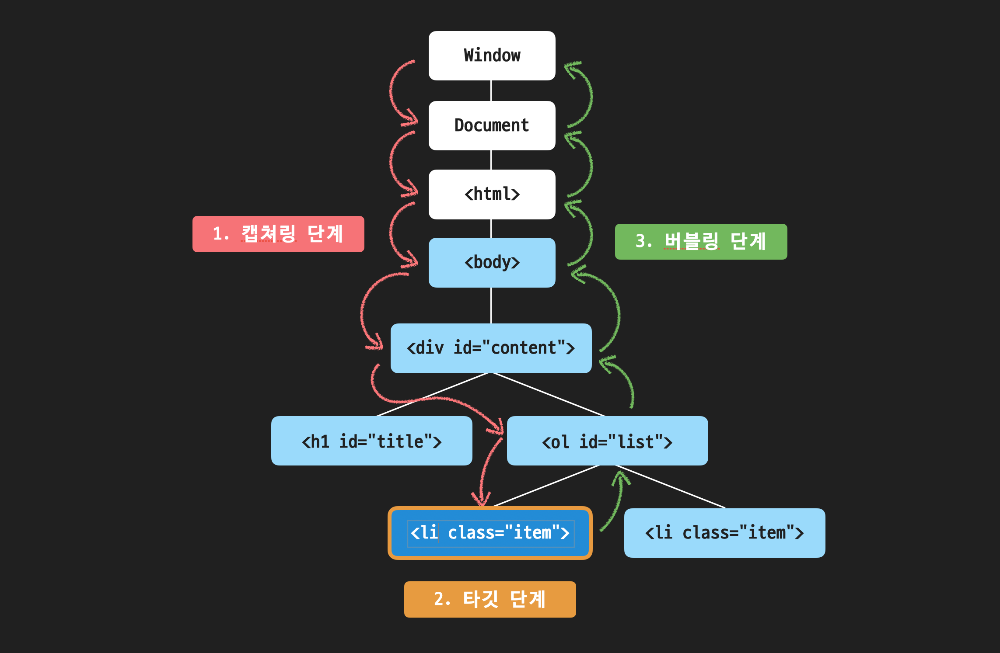

## 이벤트 캡처링

이벤트에는 버블링 이외에도 '캡처링(capturing)'이라는 흐름이 존재한다.

표준 DOM 이벤트에서 정의한 이벤트 흐름엔 3가지 단계가 있다.

1. **capturing**: 이벤트가 하위 요소로 전파되는 단계
2. **target**: 이벤트가 실제 타겟 요소에 전달되는 단계
3. **bubbling**: 이벤트가 상위 요소로 전파되는 단계

버블링은 [지난 문서](./event-bubbling.md)에서 정리했다.
**타겟 단계**는 `target` 요소에 할당된 이벤트 핸들러가 동작하는 단계인데, 쉽게 생각해서 가장 처음 이벤트 핸들러가 동작하게 되는 순간이다.

## 캡처링이란

다음과 같은 코드에서,

```js
<!DOCTYPE html>
<html lang="ko">
  <head>
    <meta charset="UTF-8">
    <title>JS with Codeit</title>
  </head>
  <body>
    <div id="content">
      <h1 id="title">오늘 할 일</h1>
      <ol id="list">
        <li class="item">자바스크립트 공부</li>
        <li class="item">독서</li>
      </ol>
    </div>
    <script src="index.js"></script>
  </body>
</html>

```

버블링은 `<li>` -> `<ol>` -> `<h1>` -> `<div>` -> `<body>` -> `<html>` -> `document` 객체 (`window` 객체) 순서로 이벤트가 전파된다.

캡처링은 이벤트가 발생하면 가장 먼저 버블링의 반대방향으로 진행되는 이벤트 전파 방식이다.



다음과 같은 과정을 통해 각 요소에 할당된 이벤트 핸들러가 호출된다.

1. 이벤트가 발생하면 `window` 객체에서부터 `target` 요소까지 이벤트 전파가 일어난다. (capturing)
2. `target` 요소에 도달하면 `target`에 등록된 이벤트 핸들러가 동작한다. (target)
3. 그후 다시 `window` 객체를 향해 이벤트가 전파된다. (bubbling)

## 캡처링 단계에서 이벤트 핸들러 실행하기

캡처링 단계에서 이벤트를 발생시켜야 하는 일은 매우 드문 경우이다.


보통 타깃 단계에서 `target`에 등록된 이벤트 핸들러가 있으면 해당 이벤트 핸들러가 먼저 동작한 후, 버블링 단계에서 각 부모 요소에 등록된 이벤트 핸들러가 있으면 그때 해당 이벤트 핸들러가 동작하는 것이 일반적이다.

캡처링 단계에서 이벤트 핸들러를 동작시키려면, `addEventListener` 메서드의 세 번째 인자로 `true` 또는 `{ capturing: true }` 옵션을 전달하면 된다.

```html
<!DOCTYPE html>
<html lang="ko">
  <head>
    <meta charset="UTF-8">
    <title>Codeit Acid Rain</title>
    <link rel="stylesheet" href="style.css">
  </head>
  <body>
    <div>DIV
      <ul>UL
        <li>LI</li>
      </ul>
    </div>  
    <script>
      for (let elem of document.querySelectorAll('*')) {
        elem.addEventListener("click", e => alert(`캡쳐링 단계: ${elem.tagName}`), true);
        elem.addEventListener("click", e => alert(`버블링 단계: ${elem.tagName}`));
      }
    </script>
  </body>
</html>
```

위 코드를 실행한 후, 어느 요소를 누르든 페이지에 있는 모든 요소들의 이벤트 핸들러가 **캡처링 단계**와 **버블링 단계**에서 부메랑처럼 실행된다.

`<li>` 태그를 클릭한 경우:

- 캡쳐링 단계에서 `<html>` -> `<body>` -> `<div>` -> `<ul>` -> `<li>` 순서로 "캡쳐링 단계: ${tagName}" 메시지가 나타난다.
- 타깃 단계에서 `<li>` 요소에 할당된 이벤트 핸들러가 실행된다.
- 이후 버블린 단계에서 `<ul>` -> `<div>` -> `<body>` -> `<html>` 순서로 "버블링 단계: ${tagName}" 메시지가 출력된다.