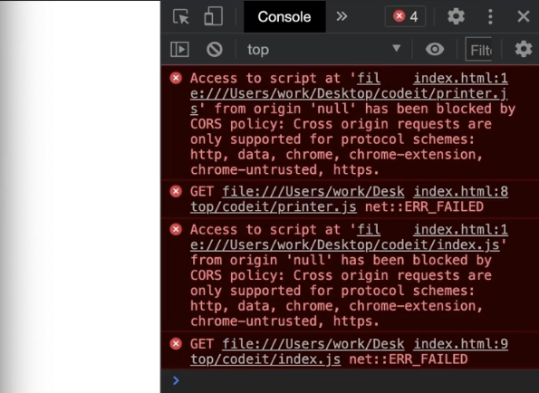

# 모듈과 모듈화

각각의 기능으로 파일을 분리하는 것을 모듈화(Modularization)라고 하고, 분리된 파일들을 모듈(Module)이라고 한다.

ES6부터 모듈화를 지원하는 표준 문법이 등장하여 대부분 프로그램에서 이 표준화된 모듈 문법을 사용한다.

## 모듈 스코프 (Module Scope)

한 모듈에서 선언한 변수나 함수가 다른 모듈에서 직접 접근할 수 없도록 모든 모듈은 독립적인 스코프를 가져야 한다.

각 모듈이 자신만의 스코프를 가지게 하여 전역 변수의 오염이 발생하지 않도록 하는 것이다.

모듈을 다른 모듈에서 사용하려면 `export`와 `import`를 사용해야 하고, 모듈을 `export` 해주지 않으면 외부에서 접근이 불가능해진다.

### 모듈 스코프 갖게 하기
HTML에서 `<script>` 태그로 자바스크립트 파일을 불러올 때, 이런 모듈 스코프를 적용시켜주기 위해서는 태그 속성에 `type='module'`을 지정해주어야 한다.

```html
<body>
    ...
    <script type='module' src='index.js'></script>
</body>
```

그러나 위와 같이 모듈 스코프를 적용한 후, 브라우저에서 바로 html 파일을 불러오면 다음과 같은 오류가 발생한다. 자바스크립트 모듈 문법을 만들 때 문법 자체의 보안 요구사항이 있기 때문이다.


이 문제를 해결하기 위해서는 서버를 통해 HTML 파일을 실행해야 한다. 