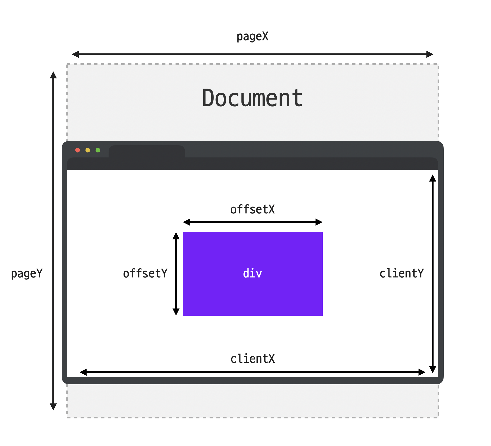

## 다양한 이벤트

### 1. `MouseEvent.button`
`MouseEvent` 객체의 `button` 프로퍼티를 활용하면, 마우스 버튼을 눌렀을 때 일어난 이벤트에 대해서 "어떤 버튼을 눌러서 일어난 이벤트인지" 정확하게 알아낼 수 있다.

|값|내용
|-|-|
0|마우스 왼쪽 버튼
1|마우스 휠
2|마우스 오른쪽 버튼
3|X1 (뒤로 가기)
4|X2 (앞으로 가기)

⚠️ `mouseenter`, `mouseleave`, `mouseover`, `mouseout`, `mousemove` 처럼 마우스 이동과 관련된 이벤트도 값이 0이다.

### 2. `MouseEvent.type`

이벤트 타입|설명
-|-
mousedown|마우스 버튼을 누르는 순간
mouseup|마우스 버튼을 떼는 순간
click|왼쪽 버튼 클릭
dbclick|왼쪽 버튼 더블 클릭
contextmenu|오른쪽 버튼 클릭
mousemove|마우스 움직인 순간
mouseover|마우스 포인터가 요소 위로 올라온 순간
mouseout|마우스 포인터가 요소에서 벗어나는 순간
mouseenter|마우스 포인터가 요소 위로 올라온 순간 (버블링 X)
mouseleave|마우스 포인터가 요소에서 벗어나는 순간 (버블링 X)

### 3. `MouseEvent`의 위치 프로퍼티

`MouseEvent` 객체는 마우스 포인터의 위치를 나타내는 여러 프로퍼티를 제공하여 다양한 좌표 정보를 얻을 수 있다.

#### clientX, clientY
- 클라이언트 영역 내 마우스 좌표 반환
- 이벤트가 발생한 시점에서 브라우저의 콘텐츠가 표시되는 영역 내에서의 좌표를 측정
- viewport 좌측 상단 모서리 위치를 (0, 0)로 계산
- viewport 내에서 마우스 포인터가 위치한 좌표를 알 수 있음

#### pageX, pageY
- 전체 문서 기준 마우스 좌표 반환
- 페이지의 스크롤 영역을 포함한 전체 문서 내에서의 좌표를 측정
- 스크롤된 영역까지 포함하여 문서의 좌측 상단 모서리가 (0, 0)으로 계산

#### offsetX, offsetY
- 이벤트가 발생한 요소 (target) 기준 마우스 좌표 반환
- 이벤트가 발생한 target 요소의 좌측 상단 모서리를 (0, 0)으로 계산
- 자식 요소 내에서 마우스를 이동할 때 유용하게 사용

#### screenX, screenY
- 모니터 화면 내에서의 마우스 좌표 반환
- 스크린 해상도와 관련된 모니터의 좌측 상단을 (0, 0)으로 기준으로 삼아 마우스의 절대적인 위치를 측정
- 다중 모니터 환경에서 유용하게 사용

### 4. `MouseEvent.relatedTarget`
`mouseenter`, `mouseleave`, `mouseover`, `mouseout` 이벤트에는 `relatedTarget`이라는 프로퍼티가 존재한다.

#### `mouseover`
- `target`: 현재 마우스 위치한 요소
- `relatedTarget`: 이벤트 발생 직전 마우스 위치해있던 요소

#### `mouseout`
- `target`: 이벤트 발생 직전 마우스 위치해있던 요소
- `relatedTarget`: 이벤트 발생 직후 마우스 위치한 요소

### 
