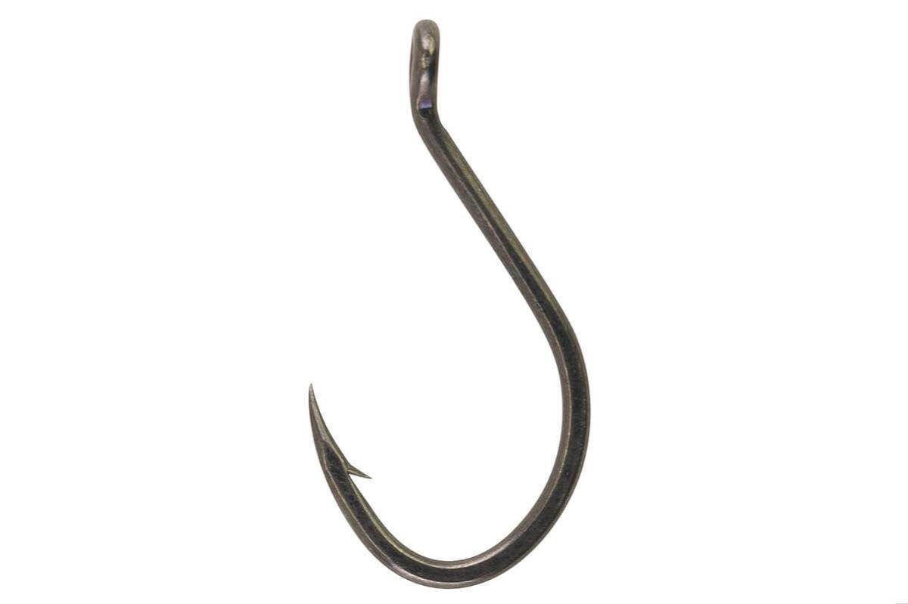

## 1. React Hooks

React Hook은 함수형 컴포넌트에서도 state나 lifecycle 같은 기능을 쓸 수 있게 해주는 특별한 함수다.

원래 리액트에서는 클래스형 컴포넌트에서만 `this.state` 같은 걸 써서 데이터를 저장하고 관리할 수 있었는데, 함수형 컴포넌트에서는 이런 걸 쓰지 못했다.

리액트 팀에서 "이거 불편한데? 함수형에서도 state 같은 거 쉽게 관리할 방법 없을까?" 해서 만든 게 React Hook이다.

Hook(갈고리)이라는 이름이 붙은 이유는, 기존의 리액트 기능(상태 관리, 생명주기 함수 등)을 **함수형 컴포넌트에 걸어서(Hook into) 사용**할 수 있기 때문이다.

## 2. React Hooks의 규칙

리액트 훅을 사용할 때에는 몇 가지 규칙들이 있다.

### 1) Hook은 반드시 함수 컴포넌트의 최상단에서만 호출

반복문, 조건문, 중첩 함수 안에서는 사용하면 안 되고, 항상 컴포넌트 함수의 “최상단”에서 사용해야 한다.

리액트는 Hook이 실행되는 순서를 보고 상태를 관리하는데,
조건문 안에서 실행되면 어떤 경우에는 실행되고, 어떤 경우에는 실행되지 않을 수도 있다.

그러면 React가 "어? Hook 순서가 바뀌었네?" 하면서 오류를 내뱉는다.

#### 🚨 잘못된 예시 (❌)

```jsx
function MyComponent() {
  if (true) {
    const [count, setCount] = useState(0); // ❌ 조건문 안에서 Hook 사용 금지!
  }
}
```

#### ✅ 올바른 사용법

```jsx
function MyComponent() {
  const [count, setCount] = useState(0); // ✅ 최상단에서 사용

  return <div>카운트: {count}</div>;
}
```

### 2) Hook은 오직 React 함수 컴포넌트 또는 커스텀 Hook에서만 호출

일반 함수나 클래스 컴포넌트에서는 Hook을 사용할 수 없다. **오직 함수형 컴포넌트 안에서 또는 커스텀 Hook에서만 사용 가능**하다.

React는 **Hook이 어느 컴포넌트에서 실행되는지 추적**해야 하는데,
일반 함수에서 사용하면 이 Hook이 “누구 것”인지 모르게 된다. 그러면 상태 관리가 불가능해진다.

#### 🚨 잘못된 예시 (❌)

```jsx
function someFunction() {
  const [count, setCount] = useState(0); // ❌ 일반 함수에서는 Hook 사용 불가!
}
```

#### ✅ 올바른 사용법

```jsx
function MyComponent() {
  const [count, setCount] = useState(0); // ✅ 함수형 컴포넌트 안에서 사용
}
```

또는

```jsx
function useCustomHook() {
    const [data, setData] = useState(null); // ✅ 커스텀 Hook에서는 사용 가능
    return data;
```

## 3. 추가 규칙

### 1) Hook은 use로 시작해야 한다

```jsx
function useNotARealHook() {
  console.log("이건 Hook이 아님!");
}
```

이렇게 하면 React가 "이거 Hook 아니면서 왜 use로 시작하냐?" 하고 경고한다. Hook처럼 동작하게 만들거나 "use"라는 이름을 쓰지 않아야 한다.

### 2) 여러 개의 Hook을 쓸 때는 순서를 지켜야 한다.

Hook은 순서대로 실행되기 때문에, 실행 순서가 달라지면 상태가 꼬일 수 있다.

조건문이나 반복문 안에서 Hook을 사용하면 안 되는 이유도 이 때문이다.

### 3) 커스텀 Hook을 만들면 기존 Hook을 감싸서 사용 가능

여러 개의 Hook을 하나의 함수로 묶어서 관리하고 싶으면 커스텀 Hook을 만들면 된다.

```jsx
function useCounter() {
  const [count, setCount] = useState(0);
  return [count, setCount];
}
```
