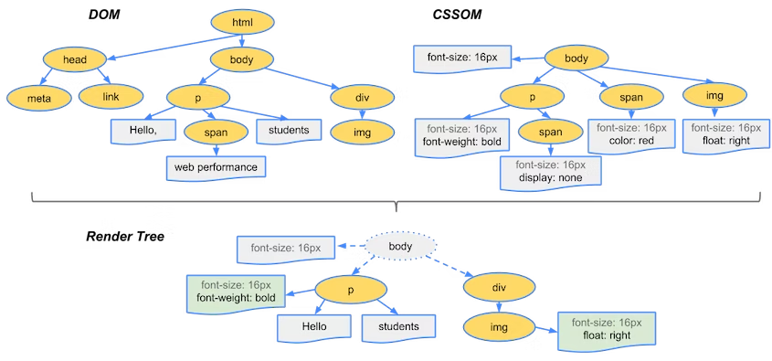

# 브라우저가 어떻게 동작하는지 설명해 주세요.

## 1. 브라우저의 구조

브라우저는 여러 구성 요소를 통해 웹 페이지를 불러오고, 해석하고, 화면에 표시하는 역할을 합니다.

### 사용자 인터페이스

- 주소창, 뒤로 가기/앞으로 가기 버튼, 새로고침 버튼, 설정 메뉴 등
- 웹 페이지가 표시되는 영역을 제외한 모든 요소를 포함

### 브라우저 엔진

- 사용자 인터페이스와 렌더링 엔진 사이의 동작을 제어해주는 엔진
- 자료 저장소를 참조하며 로컬에 데이터를 읽기/쓰기 하면서 다양한 작업 수행

### 렌더링 엔진

- 요청한 콘텐츠를 표시
- 요청한 웹 페이지의 HTML과 CSS를 파싱하여 화면에 표시

### 네트워크 모듈

- HTTP 요청 및 응답 처리
- HTTPS, WebSocket 등을 통한 데이터 송수신

### 자바스크립트 해석기

- 자바스크립트 코드를 해석하고 실행
- Chrome의 V8, Firefox의 SpiderMonkey, Safari의 JavaScriptCore 등

### UI 백엔드

- 브라우저 기본 UI 요소 (input, button 등)를 그림
- 운영체제(OS)에서 제공하는 UI 요소를 사용

### 자료 저장소

- 쿠키, 로컬 스토리지, 세션 스토리지, IndexedDB 등을 관리

## 2.통신 과정

사용자가 웹 페이지를 요청하면, 브라우저는 다음 과정을 거쳐 화면에 표시합니다.

### 1) DNS 조회

사용자가 https://google.com을 입력하면, 브라우저는 DNS 서버에서 해당 도메인의 IP 주소(예: 50.123.123.12)를 조회

### 2) 서버와 연결 (TCP & TLS 핸드셰이크)

- 브라우저는 서버와 TCP 연결을 설정
- HTTPS의 경우, TLS(SSL) 협상을 수행하여 보안 연결 설정

### 3) HTTP 요청 전송

- 브라우저가 서버에 HTTP GET 요청을 보내 HTML 문서를 요청

### 4) 응답 수신 및 렌더링 시작

- 서버가 HTML, CSS, JavaScript 등의 데이터를 보내면, 브라우저는 이를 해석하여 화면에 표시

## 3. 렌더링 과정

브라우저는 받은 HTML, CSS, JavaScript 파일을 화면에 표시하는 렌더링 과정을 수행합니다.

### 1) HTML & CSS 파싱

브라우저는 서버로부터 받은 HTML과 CSS를 다운로드 받습니다.

이 때 HTML, CSS 파일은 단순한 텍스트이므로 연산과 관리를 위해 Parser를 통해 Object Model로 만듭니다. HTML은 DOM Tree로 CSS는 CSSOM으로 만듭니다.

이후 DOM과 CSSOM을 결합한 Render Tree 생성하여 실제 화면에 표현되는 노드들로만 구성합니다.

### 2) Layout

Render Tree 노드들이 가지고 있는 스타일과 속성에 따라서 브라우저 화면의 어느 위치에 어떤 크기로 출력할지 계산합니다.

### 3) Paint

Layout 계산이 완료되면 요소들을 실제 화면에 그립니다. 이전 단계에서 요소들의 위치와 크기, 스타일 계산이 완료된 Render Tree를 이용해 실제 값을 채워 넣습니다. 이 때 텍스트, 색, 이미지, 그림자 효과 등을 모두 처리해 그립니다.
